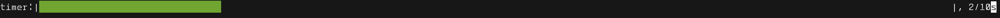

# shellTimer

For those that live in the terminal and needs to set-up a timer for small things

usage: timer.py [-h] [-s [1-1000] | -m [1-120] | -ho 1 or 2 | -t 10:00]

working mode for timer

optional arguments:
  -h, --help

  -s [1-1000], --sec [1-1000] seconds to time

  -m [1-120], --min [1-120] minutes to time (default: 9 mins mainly because for the pasta cooking)

  -ho 1 or 2, --hour 1 or 2 hours to time

  -t 10:00, --time 10:00 time to time
